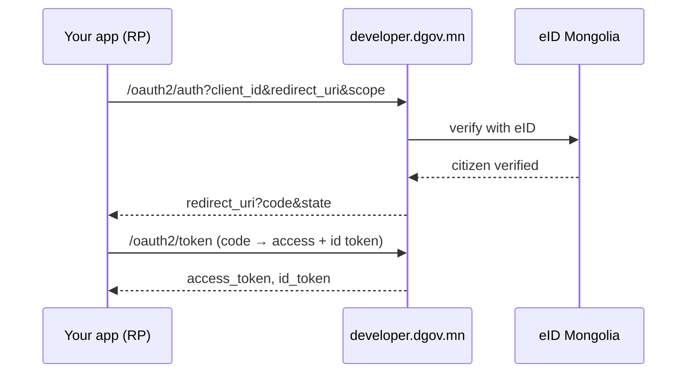

# Authentication (eID + OIDC)

How your users authenticate through the portal:

- **eID sign-in** — with the electronic ID (QR / App2App / national-ID push).
- **Google linking** — link a Google account after an eID verification for
  one-tap repeat sign-ins.
- **OIDC provider** — the portal itself is an OpenID Connect provider; your app
  receives the verified identity as standard claims.

## eID sign-in

Push straight to the eID app (App2App) or scan a QR code. Portal sessions are
JWT access + refresh (rotation); logout revokes both (refresh + access
deny-list). There is no password or email/OTP login anywhere.

The `sub` (subject) is the portal's **stable, opaque per-citizen identifier**
(user UUID) — the same user always yields the same `sub` in your app.

## OIDC provider

The portal is an OpenID Connect provider built on its **own Go code** (no
external OAuth server). Relying-party (RP) apps delegate sign-in to the portal
and receive verified user data as standard claims.

!!! tip "Sign-in is a built-in (base) service"
    OIDC sign-in is served to **every registered app** automatically via the
    base scopes (`openid profile email`). Login is not granted or blocked per
    app. **Add-on** services (like the eID proxy) do require per-app
    authorization — see [eID Service Proxy](eid-services.md).

To connect your app, see [App integration](sso-integration.md) or start with
the [Quickstart](quickstart.md).
