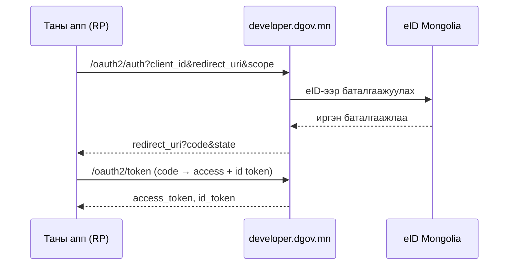

# Нэвтрэлт (eID + OIDC)

Хэрэглэгч тань порталаар хэрхэн баталгаажих вэ:

- **eID нэвтрэлт** — цахим үнэмлэхээр (QR / App2App / РД push).
- **Google холболт** — eID баталгаажуулалтын дараа Google дансаа холбож, цаашид
  нэг товшилтоор нэвтэрнэ.
- **OIDC провайдер** — портал өөрөө OpenID Connect провайдер; таны апп
  баталгаажсан identity-г стандарт claim-аар авна.

## eID нэвтрэлт

Цахим үнэмлэхийн апп руу шууд мэдэгдэл (App2App) илгээх, эсвэл QR код уншуулна.
Порталын session нь JWT access + refresh (rotation); logout хоёуланг хүчингүй
болгоно (refresh + access deny-list). Нууц үг / и-мэйл-OTP нэвтрэлт огт байхгүй.

`sub` (subject) нь порталын **тогтвортой, opaque per-citizen танигч** (user UUID)
— нэг хэрэглэгч таны апп-д үргэлж ижил `sub`-тай ирнэ.

## OIDC провайдер

Портал нь **өөрийн Go код** дээр суурилсан OpenID Connect провайдер (гадны OAuth
сервергүй). Relying party (RP) апп-ууд нэвтрэлтээ порталд даатган, хэрэглэгчийн
баталгаажсан мэдээллийг стандарт claim-аар авна.

!!! tip "Нэвтрэлт бол суурь (built-in) үйлчилгээ"
    OIDC нэвтрэлт нь **бүх бүртгэгдсэн апп**-д base scope (`openid profile
    email`)-оор автоматаар үйлчилнэ. Нэвтрэлтийг per-app checkbox-оор олгодоггүй,
    хаадаггүй. Харин **нэмэлт** service-үүд (eID proxy гэх мэт) нь per-app
    зөвшөөрөл шаарддаг — [eID Service Proxy](eid-services.md)-г үз.

Апп-аа холбохын тулд [Апп холбох](sso-integration.md), эсвэл
[Түргэн эхлэл](quickstart.md)-ээс эхэл.
