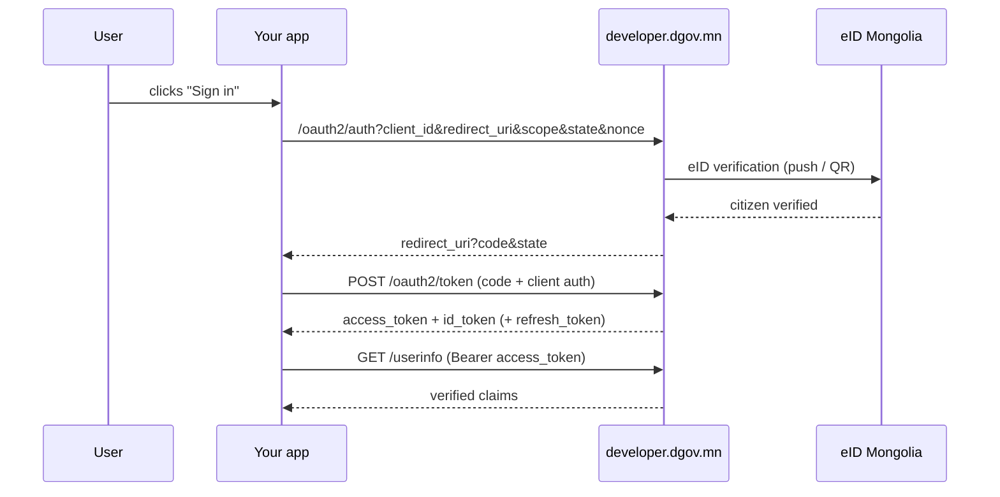

# App integration (OAuth2 / OIDC)

Connect your app as a relying party (RP) of the **Government Developer Portal**
(issuer `https://developer.dgov.mn`). When the user clicks "Sign in", they are
redirected to the portal, verify with their eID, and return to your app.

## 1. Register your app

Sign in to the [console](https://developer.dgov.mn) with your eID and create the
app under **Applications → New app** with its name and redirect URI. You receive
a `client_id` (plus a `client_secret` for confidential apps) — see the
[Quickstart](quickstart.md).

**Confidential or public?**

| Type | When | Authentication |
|---|---|---|
| Confidential | Server-side web app | `client_secret` (basic auth) |
| Public | Mobile app, SPA | No secret — **PKCE (S256) required** |

## 2. Authorization code flow



### Authorize request

```text
GET https://developer.dgov.mn/oauth2/auth
  ?response_type=code
  &client_id=<CLIENT_ID>
  &redirect_uri=<REGISTERED_URI>
  &scope=openid profile email
  &state=<random>          ← CSRF protection, verify on callback
  &nonce=<random>          ← echoed in the id_token, verify it
```

Public clients additionally send:

```text
  &code_challenge=<BASE64URL(SHA256(code_verifier))>
  &code_challenge_method=S256
```

### Token exchange

=== "Confidential (secret)"

    ```bash
    curl -s https://developer.dgov.mn/oauth2/token \
      -u "<CLIENT_ID>:<CLIENT_SECRET>" \
      -d grant_type=authorization_code \
      -d code=<CODE> \
      -d redirect_uri=<REGISTERED_URI>
    ```

=== "Public (PKCE)"

    ```bash
    curl -s https://developer.dgov.mn/oauth2/token \
      -d grant_type=authorization_code \
      -d client_id=<CLIENT_ID> \
      -d code=<CODE> \
      -d redirect_uri=<REGISTERED_URI> \
      -d code_verifier=<CODE_VERIFIER>
    ```

### Verifying the id_token

Validate the RS256 signature against the
[JWKS](https://developer.dgov.mn/.well-known/jwks.json), plus
`iss == https://developer.dgov.mn`, `aud == client_id`, `exp` and `nonce`.
OIDC libraries (openid-client, Spring Security, AppAuth…) do this automatically.

## 3. Refresh tokens

If you requested the `offline_access` scope, the token response includes a
`refresh_token`:

```bash
curl -s https://developer.dgov.mn/oauth2/token \
  -u "<CLIENT_ID>:<CLIENT_SECRET>" \
  -d grant_type=refresh_token \
  -d refresh_token=<REFRESH_TOKEN>
```

!!! warning "Refresh tokens rotate"
    Every refresh returns a **new** refresh_token and invalidates the old one.
    Always store the newest; reusing an old one revokes the whole token family
    (theft protection).

## 4. Logout

RP-initiated logout — redirect the user to the end-session endpoint:

```text
GET https://developer.dgov.mn/oauth2/sessions/logout
  ?id_token_hint=<ID_TOKEN>
  &post_logout_redirect_uri=<REGISTERED_POST_LOGOUT_URI>
```

!!! warning "Post-logout URIs must be registered"
    The `post_logout_redirect_uri` must be **registered** on the client —
    otherwise you get *"post_logout_redirect_uri is not whitelisted"*. The
    console registers login and post-logout URIs together.

## 5. Security requirements

- Store `state` in the session and **always** compare it on the callback (CSRF).
- Compare `nonce` against the id_token claim (replay protection).
- Keep tokens **server-side only** (httpOnly cookies / sessions) — never expose
  them to browser JS.
- Never commit `client_secret` — use a secret manager.
- Register redirect URIs over HTTPS, exactly (no wildcards).

## Troubleshooting

| Symptom | Cause |
|---|---|
| `invalid_grant` on token | Codes are single-use / expired / redirect_uri mismatch |
| `invalid_client` | Broken basic auth — check the `-u "id:secret"` format |
| `access_denied` on callback | The user declined consent |
| PKCE error | Check the `code_verifier` matches the challenge you sent |
