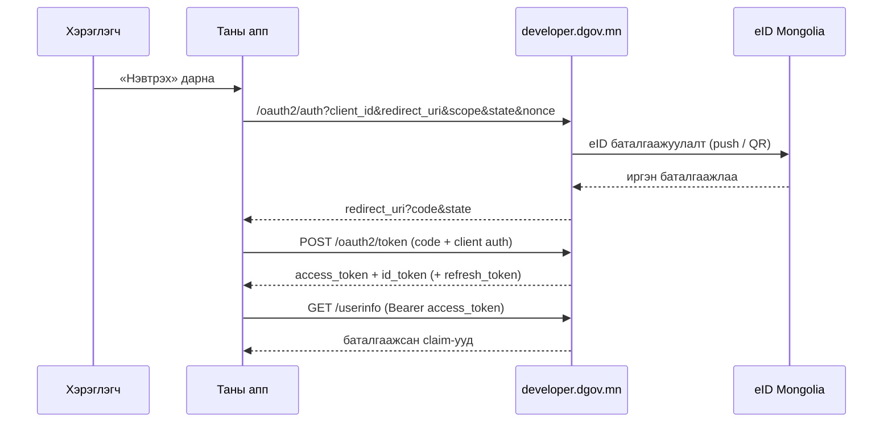

# Апп холбох (OAuth2 / OIDC)

Аппаа **Government Developer Portal** (issuer `https://developer.dgov.mn`)-ийн
relying party (RP) болгож холбоно. «Нэвтрэх» товч дарахад хэрэглэгч портал руу
шилжиж, eID-ээр баталгаажиж, апп руугаа буцна.

## 1. Апп бүртгэх

[Консол](https://developer.dgov.mn) дээр eID-ээрээ нэвтэрч **Applications →
Шинэ апп** дээр нэр, redirect URI-гаа бүртгэнэ. `client_id` (confidential бол
`client_secret` хамт) олгогдоно — [Түргэн эхлэл](quickstart.md)-ийг үз.

**Confidential уу, public уу?**

| Төрөл | Хэзээ | Баталгаажуулалт |
|---|---|---|
| Confidential | Сервертэй web апп | `client_secret` (basic auth) |
| Public | Mobile апп, SPA | Secret байхгүй — **PKCE (S256) заавал** |

## 2. Authorization code урсгал



### Authorize хүсэлт

```text
GET https://developer.dgov.mn/oauth2/auth
  ?response_type=code
  &client_id=<CLIENT_ID>
  &redirect_uri=<БҮРТГЭСЭН_URI>
  &scope=openid profile email
  &state=<санамсаргүй>          ← CSRF хамгаалалт, callback дээр шалга
  &nonce=<санамсаргүй>          ← id_token-д буцна, шалга
```

Public client нэмж илгээнэ:

```text
  &code_challenge=<BASE64URL(SHA256(code_verifier))>
  &code_challenge_method=S256
```

### Token солилцоо

=== "Confidential (secret)"

    ```bash
    curl -s https://developer.dgov.mn/oauth2/token \
      -u "<CLIENT_ID>:<CLIENT_SECRET>" \
      -d grant_type=authorization_code \
      -d code=<CODE> \
      -d redirect_uri=<БҮРТГЭСЭН_URI>
    ```

=== "Public (PKCE)"

    ```bash
    curl -s https://developer.dgov.mn/oauth2/token \
      -d grant_type=authorization_code \
      -d client_id=<CLIENT_ID> \
      -d code=<CODE> \
      -d redirect_uri=<БҮРТГЭСЭН_URI> \
      -d code_verifier=<CODE_VERIFIER>
    ```

### id_token шалгах

RS256 гарын үсгийг [JWKS](https://developer.dgov.mn/.well-known/jwks.json)-ээр,
мөн `iss == https://developer.dgov.mn`, `aud == client_id`, `exp`, `nonce`-ийг
шалга. OIDC сан (openid-client, Spring Security, AppAuth…) автоматаар хийдэг.

## 3. Refresh token

`offline_access` scope хүссэн бол token хариунд `refresh_token` ирнэ:

```bash
curl -s https://developer.dgov.mn/oauth2/token \
  -u "<CLIENT_ID>:<CLIENT_SECRET>" \
  -d grant_type=refresh_token \
  -d refresh_token=<REFRESH_TOKEN>
```

!!! warning "Refresh token эргэлддэг (rotation)"
    Refresh бүрт **шинэ** refresh_token ирж, хуучин нь хүчингүй болно. Шинийг нь
    үргэлж хадгал; хуучныг давхар хэрэглэвэл token гэр бүл бүхэлдээ цуцлагдана
    (хулгайн хамгаалалт).

## 4. Гарах (logout)

RP-initiated logout — хэрэглэгчийг end-session руу шилжүүл:

```text
GET https://developer.dgov.mn/oauth2/sessions/logout
  ?id_token_hint=<ID_TOKEN>
  &post_logout_redirect_uri=<БҮРТГЭСЭН_POST_LOGOUT_URI>
```

!!! warning "Post-logout URI бүртгэлтэй байх ёстой"
    `post_logout_redirect_uri` нь client-д **бүртгэгдсэн** байх ёстой — эс бөгөөс
    *"post_logout_redirect_uri is not whitelisted"* алдаа гарна. Консол login
    болон post-logout URI-г хамт бүртгэдэг.

## 5. Аюулгүй байдлын шаардлага

- `state`-ийг session-д хадгалж callback дээр **заавал** тулга (CSRF).
- `nonce`-ийг id_token-ий claim-тай тулга (replay).
- Токенуудыг **зөвхөн сервер талд** (httpOnly cookie / session) хадгал — браузерын
  JS-д бүү өг.
- `client_secret`-ийг репод бүү commit хий — secret manager ашигла.
- Redirect URI-г HTTPS-ээр, яг таг бүртгэ (wildcard байхгүй).

## Түгээмэл асуудал

| Шинж тэмдэг | Учир |
|---|---|
| `invalid_grant` token дээр | Code 1 удаа л хэрэглэгдэнэ / хугацаа дууссан / redirect_uri зөрсөн |
| `invalid_client` | Basic auth буруу — `-u "id:secret"` форматыг шалга |
| Callback дээр `access_denied` | Хэрэглэгч зөвшөөрөл өгөөгүй |
| PKCE алдаа | `code_verifier` нь challenge-ээ үүсгэсэн утга мөн эсэхийг шалга |
